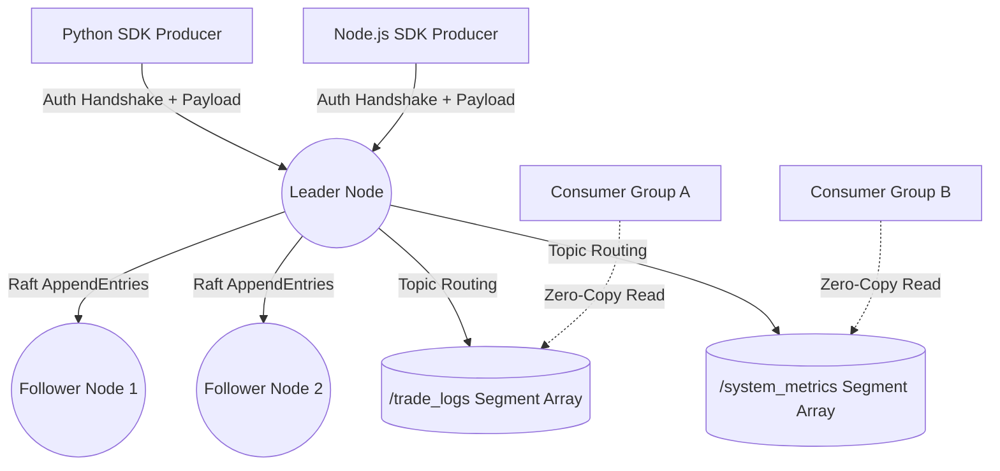

<div align="center">
  
# 🚀 CoreStream

**A High-Performance, Distributed Event Streaming Engine built in Rust.**

[](https://www.rust-lang.org/)
[](https://opensource.org/licenses/MIT)
[]()
[]()

*A lightweight, natively compiled alternative to Apache Kafka and RabbitMQ.*

</div>

---

## ⚡ Overview

**CoreStream** is a distributed commit log and event messaging broker written from scratch in Rust. It was built to solve the complexities of massive-scale telemetry, microservice event-sourcing, and real-time data pipelines without the JVM overhead of traditional enterprise streaming platforms.

By leveraging **OS-level Memory Mapped Files (mmap)**, **Zero-Copy Reads**, and the **Raft Consensus Algorithm**, CoreStream achieves blistering throughput with guaranteed fault tolerance across distributed node clusters.

---

## ✨ Enterprise Features

- 🏎️ **Zero-Copy Architecture:** Consumers read data directly from the OS Page Cache via `std::os::unix::fs::FileExt`, bypassing user-space memory entirely for maximum throughput.
- 🧠 **Raft Consensus & High Availability:** Nodes automatically hold cryptographic elections, assign Leaders, and continuously replicate logs to Followers to guarantee fault tolerance if a server crashes.
- 🗂️ **Multi-Topic Partitions:** Dynamically routes incoming data into isolated topic directories and dedicated `mmap` indices, allowing tens of thousands of consumers to read different topics entirely in parallel.
- 🧹 **Automated Garbage Collection:** Logs are dynamically rotated into size-bounded segments. A background asynchronous thread continuously sweeps and purges historical segments older than the retention policy (e.g., 7 days) to protect hard drive space.
- 🔒 **Zero-Trust Security:** Built-in TCP Firewall. All cluster nodes, producers, and consumers must complete a Protobuf-encoded API Key Handshake before establishing a stream, instantly severing unauthorized connections.
- 📡 **Agentic AI Telemetry:** Includes a raw TCP HTTP Bridge and web dashboard for real-time visualization of the Raft cluster state, Leader elections, and internal storage offsets.

---

## 🏗️ Architecture



---

## 🚀 Getting Started

### 1. Booting the Cluster

You can spin up a highly available 3-node cluster on your local machine instantly.

**Terminal 1 (Node 1):**
```bash
cargo run --bin corestream -- --node-id 1 --port 9092 --peers 127.0.0.1:9093,127.0.0.1:9094
```

**Terminal 2 (Node 2):**
```bash
cargo run --bin corestream -- --node-id 2 --port 9093 --peers 127.0.0.1:9092,127.0.0.1:9094
```

**Terminal 3 (Node 3):**
```bash
cargo run --bin corestream -- --node-id 3 --port 9094 --peers 127.0.0.1:9092,127.0.0.1:9093
```
*The nodes will immediately communicate, hold a Raft election, and declare a Leader!*

---

### 2. Monitoring the Cluster

Start the HTTP Telemetry bridge to monitor the health of your Raft consensus in real time.
```bash
cargo run --bin telemetry -- --serve
```
Open your browser to `dashboard.html` to view the beautiful visualization of your active nodes.

---

## 💻 Official Client SDKs

CoreStream includes native Client SDKs that handle TCP socket connections, dynamic Protobuf serialization, and security handshakes out of the box.

### Python SDK
Located in `/corestream-python/corestream.py`
```python
from corestream import CoreStreamClient

# Connect to the Leader Node with your secret API Key
client = CoreStreamClient("127.0.0.1", 9092, "super_secret_corestream_key")

# Publish binary data to any topic dynamically
client.produce("payment_logs", b"User #8493 Paid $50.00")
```

### Node.js SDK
Located in `/corestream-node/corestream.js`
```javascript
const CoreStreamClient = require('./corestream');

(async () => {
    // Connect to the Leader Node
    const client = new CoreStreamClient('127.0.0.1', 9092, 'super_secret_corestream_key');
    await client.connect();

    // Publish data asynchronously
    await client.produce('clickstream', 'User clicked the checkout button.');
})();
```

---

## 🛡️ License

This project is licensed under the MIT License - see the [LICENSE](LICENSE) file for details.

<div align="center">
  <i>Built with ❤️ for High-Performance Distributed Systems.</i>
</div>
