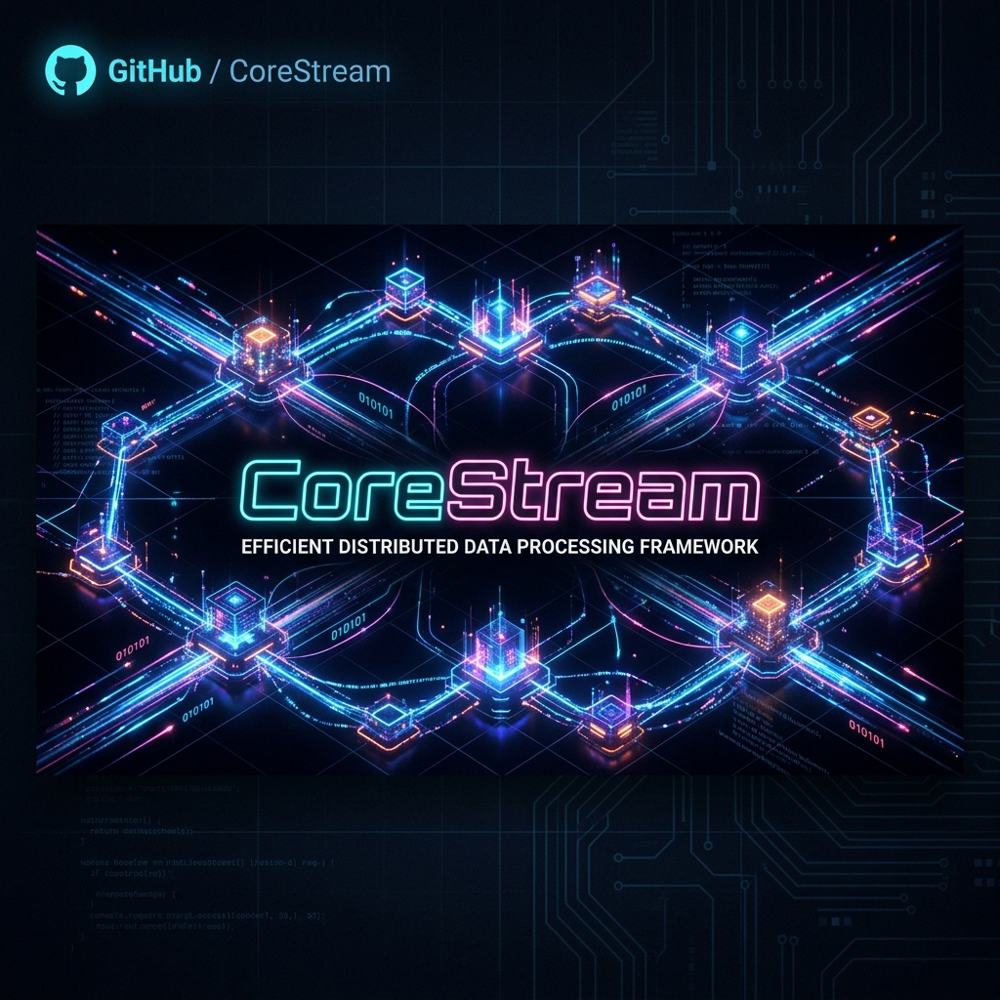
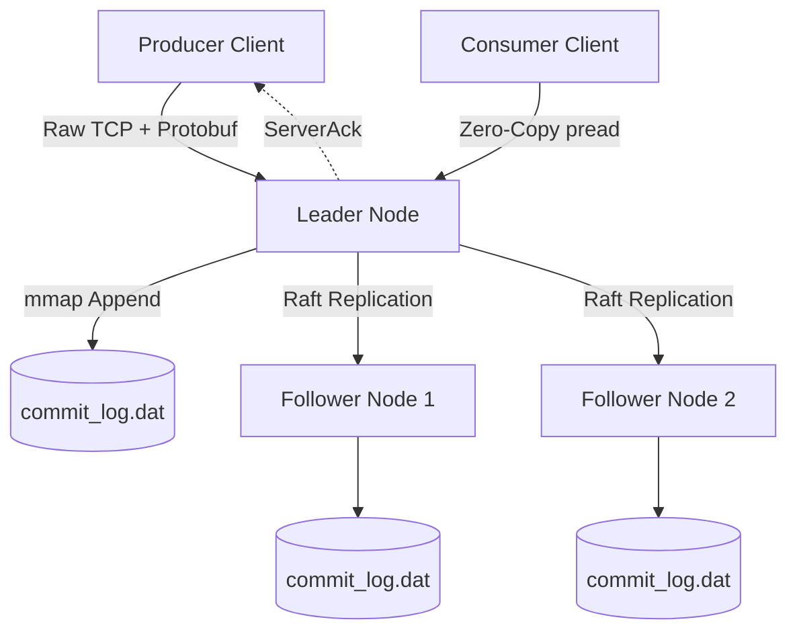

<div align="center">
  
  
  <h1>CoreStream</h1>
  <p><b>A hyper-fast, partition-tolerant, zero-copy distributed binary message broker.</b></p>

  [](https://www.rust-lang.org/)
  [](https://opensource.org/licenses/MIT)
  [](http://makeapullrequest.com)

  <p>
    <a href="#-why-corestream">Why CoreStream?</a> •
    <a href="#-architecture">Architecture</a> •
    <a href="#-getting-started">Getting Started</a> •
    <a href="#-contributing">Contributing</a>
  </p>
</div>

---

## ⚡ Why CoreStream?

CoreStream is built from scratch as a lightweight, bare-metal alternative to heavyweight event streaming platforms like **Apache Kafka** or **RabbitMQ**. It forces data through the absolute lowest levels of the OS to guarantee maximum throughput and zero data loss.

If you need to process millions of transactions, logs, or events per second without the overhead of the JVM or heavy HTTP frameworks, CoreStream is your engine.

### 🔑 Key Features
* **Zero HTTP/REST:** 100% raw asynchronous TCP socket networking via `tokio`. No bloated HTTP overhead.
* **Protobuf Native:** Fully utilizes Google Protocol Buffers for dense, serialized binary communication.
* **Memory-Mapped Storage:** Bypasses traditional SQL overhead. Writes sequentially to an append-only commit log (`.dat`), utilizing `mmap` for instant, high-speed RAM-to-disk index lookups.
* **Raft Consensus Built-in:** Implements the Raft Protocol from scratch. Provides Leader Election, Heartbeats, and Quorum-based Log Replication (2/3 nodes) out of the box to guarantee partition-tolerance.
* **Zero-Copy Consumer Reads:** Fetches data straight from the Linux OS Page Cache and blasts it into the outbound TCP network socket via `pread`, completely bypassing user-space memory allocation.
* **AI Telemetry Hook:** Exposes an internal raw TCP telemetry multiplexer hook to allow external autonomous AI Agents to read real-time cluster state, replica lag, and leader status.

---

## 🏗️ Architecture



---

## 🚀 Getting Started

### Prerequisites
* **Rust Toolchain:** `1.70+`
* **Protobuf Compiler:** `protoc`
* **Environment:** Designed for Linux environments (native or WSL2). Windows environments will incur I/O penalties due to native file-locking differences.

### Installation
Clone the repository:
```bash
git clone https://github.com/lochanachamod/corestream.git
cd corestream
cargo build
```

### Quick Start: Spin up a Local Cluster

**1. Boot the Nodes (Open 3 separate terminals):**
```bash
# Terminal 1
cargo run --bin corestream -- --node-id 1 --port 9092 --peers 127.0.0.1:9093,127.0.0.1:9094

# Terminal 2
cargo run --bin corestream -- --node-id 2 --port 9093 --peers 127.0.0.1:9092,127.0.0.1:9094

# Terminal 3
cargo run --bin corestream -- --node-id 3 --port 9094 --peers 127.0.0.1:9092,127.0.0.1:9093
```
*Wait 2 seconds. The cluster will negotiate and automatically elect a LEADER.*

**2. Open the AI Telemetry Dashboard:**
```bash
# Terminal 4
cargo run --bin telemetry
```

**3. Produce and Consume Messages:**
```bash
# Terminal 5: Blast binary payloads into the Leader
cargo run --bin producer

# Fetch the raw data back using Zero-Copy reads
cargo run --bin consumer
```

---

## 🤝 Contributing

CoreStream is a raw infrastructure project and a rite of passage for backend engineers. We are actively looking for contributors to help expand its capabilities!

**Future Roadmap / Good First Issues:**
- [ ] Implement dynamic batch-window sizing for high-latency follower links.
- [ ] Implement multi-topic partitions.
- [ ] Build a local CLI tool to inspect the raw `commit_log.dat`.
- [ ] Add TLS support to the raw TCP streams.

To contribute, simply fork the repository, create a feature branch, and submit a PR.

---
<div align="center">
<i>Built with 🦀 Rust and raw Unix I/O.</i>
</div>
