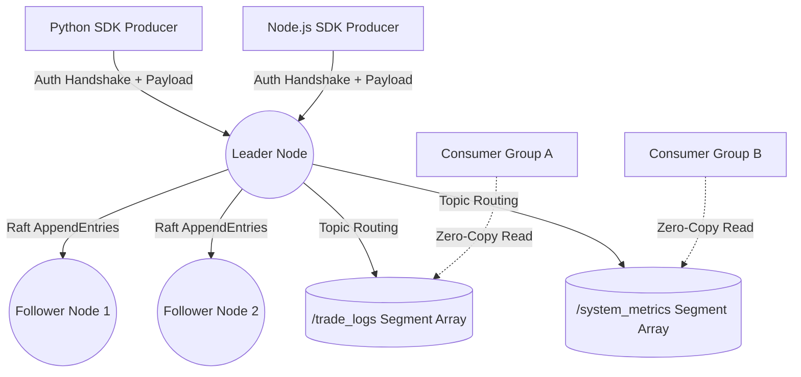

<div align="center">
  
# 🚀 CoreStream

**A High-Performance, Distributed Event Streaming Engine built in Rust.**

[](https://www.rust-lang.org/)
[](https://opensource.org/licenses/MIT)
[]()
[]()

*A lightweight, natively compiled alternative to Apache Kafka and RabbitMQ.*

</div>

---

## ⚡ Overview & Benefits

**CoreStream** is a distributed commit log and event messaging broker written from scratch in Rust. It was built to solve the complexities of massive-scale telemetry, microservice event-sourcing, and real-time data pipelines without the JVM memory overhead of traditional enterprise streaming platforms.

**Why use CoreStream?**
1. **Lightweight & Fast**: Compiled natively in Rust, memory footprint is a fraction of Kafka's.
2. **Highly Available**: If a server catches on fire, the cluster automatically heals itself via Raft Consensus.
3. **Infinite Scaling**: Dynamic topic partitions allow an infinite number of consumers to read different topics simultaneously without bottlenecking disk I/O.
4. **Self-Managing**: Built-in garbage collection prevents disk overflow automatically.

---

## 🧠 Deep Dive: How It Works

CoreStream operates identically to industry giants, utilizing low-level hardware optimizations to maximize throughput.

### 1. Zero-Trust Security Handshake
When a client (Producer or Consumer) connects over TCP, they hit a strict firewall. The client must instantly transmit a Protobuf `AuthHandshake` containing the `CORESTREAM_API_KEY`. If they fail, the socket is aggressively dropped.

### 2. The Raft Consensus Algorithm
The cluster boots as a group of nodes. They hold a cryptographic election and choose a **Leader**. 
When a Producer pushes a message (e.g., a "Payment Processed" event), it hits the Leader. The Leader does not immediately save it. First, it broadcasts an `AppendEntries` payload to the **Follower Nodes**. Once a majority of followers acknowledge receipt, the Leader "commits" the data, guaranteeing fault tolerance.

### 3. Log Segmentation & Garbage Collection
When data is written to disk, it isn't dumped into one massive file. CoreStream routes the data into a **Topic Folder** (e.g., `/payment_logs/`), and chunks it into `Segments` (e.g., `0000.log`, `0001.log`). 
A background asynchronous `tokio` thread continuously sweeps the disk. If it finds a log segment older than 7 days, it safely deletes it, preventing the server from running out of hard drive space.

### 4. Zero-Copy Consumer Reads
When a Consumer wants to read the data, CoreStream bypasses the application's RAM entirely. Using `std::os::unix::fs::FileExt`, CoreStream reads the data directly from the **OS Page Cache** and blasts it straight into the TCP network socket. This is known as a "Zero-Copy" read, and it is the secret to CoreStream's blistering speed.

---

## 🏗️ Architecture



---

## 🚀 Getting Started

### 1. Booting the Cluster

You can spin up a highly available 3-node cluster on your local machine instantly.

**Terminal 1 (Node 1):**
```bash
cargo run --bin corestream -- --node-id 1 --port 9092 --peers 127.0.0.1:9093,127.0.0.1:9094
```

**Terminal 2 (Node 2):**
```bash
cargo run --bin corestream -- --node-id 2 --port 9093 --peers 127.0.0.1:9092,127.0.0.1:9094
```

**Terminal 3 (Node 3):**
```bash
cargo run --bin corestream -- --node-id 3 --port 9094 --peers 127.0.0.1:9092,127.0.0.1:9093
```
*The nodes will immediately communicate, hold a Raft election, and declare a Leader!*

---

### 2. Monitoring the Cluster

Start the HTTP Telemetry bridge to monitor the health of your Raft consensus in real time.
```bash
cargo run --bin telemetry -- --serve
```
Open your browser to `dashboard.html` to view the beautiful visualization of your active nodes.

---

## 💻 Official Client SDKs

CoreStream includes native Client SDKs that handle TCP socket connections, dynamic Protobuf serialization, and security handshakes out of the box.

### Python SDK
Located in `/corestream-python/corestream.py`
```python
from corestream import CoreStreamClient

# Connect to the Leader Node with your secret API Key
client = CoreStreamClient("127.0.0.1", 9092, "super_secret_corestream_key")

# Publish binary data to any topic dynamically
client.produce("payment_logs", b"User #8493 Paid $50.00")
```

### Node.js SDK
Located in `/corestream-node/corestream.js`
```javascript
const CoreStreamClient = require('./corestream');

(async () => {
    // Connect to the Leader Node
    const client = new CoreStreamClient('127.0.0.1', 9092, 'super_secret_corestream_key');
    await client.connect();

    // Publish data asynchronously
    await client.produce('clickstream', 'User clicked the checkout button.');
})();
```

---

## 🤝 Contributing

We welcome contributions from the community to help make CoreStream the best streaming engine in the world! 

Please read our [CONTRIBUTING.md](CONTRIBUTING.md) for details on our code of conduct, how to submit pull requests, and the future development roadmap (including TLS, Consumer Groups, and more Client SDKs).

---

## 🛡️ License

This project is licensed under the MIT License - see the [LICENSE](LICENSE) file for details.

<div align="center">
  <i>Built with ❤️ for High-Performance Distributed Systems.</i>
</div>
